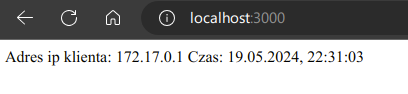
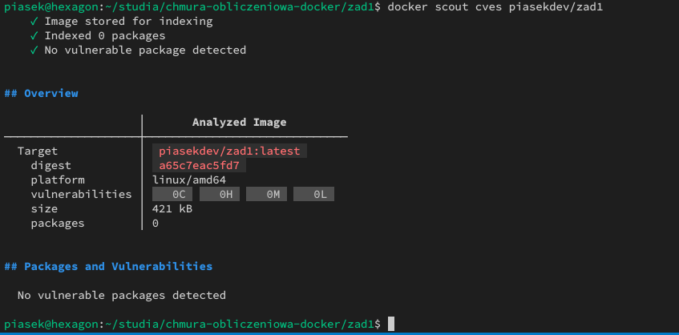

# Sprawozdanie z laboratorium Programowania aplikacji w chmurze obliczeniowej

## Autor sprawozdania: Maciej Krzysztof Piasecki (97701)

### Zadanie 1 - część obowiązkowa

#### Polecenie budujące obraz kontenera

W celu zbudowania obrazu wystarczy przejść do katalogu repozytorium i wykonać następujące polecenie.

```shell
docker build .
```

W moim przypadku dodatkowo otagowałem obraz tak, aby móc go umieścić na Docker Hub.  
Dodałem w tym celu dodatkowy argument `-t piasekdev/zad1`.

```shell
docker build -t piasekdev/zad1 .
```

Opcjonalnie podanie argumentu DEBUG=1 jako build arg zbuduje obraz w trybie debug (program będzie wyświetlał dodatkowe informacje w trakcie działania).

```shell
docker build --build-arg DEBUG=1 -t piasekdev/zad1 .
```

#### Polecenie uruchamiające kontener na podstawie zbudowanego obrazu

W celu uruchomienia kontenera należy wykonać następujące polecenie.

```shell
docker run --name zad1 -p 3000:80 piasekdev/zad1
```

Gdzie:

- Argument `--name zad1` (opcjonalny) nada kontenerowi nazwę `zad1`, ułatwiając jego późniejszą identyfikację (można tu zamiast `zad1` podać własną nazwę)
- Argument `-p` przekieruje komunikację skierowaną do portu `3000` (port przykładowy - można podać dowolny dostępny) hosta do portu `80` wewnątrz kontenera
- Argument `piasekdev/zad1` wskaże na obraz, na podstawie którego zostanie stworzony i uruchomiony kontener

#### Sposób uzyskania informacji, które wygenerował serwer w trakcie uruchamiana kontenera

W celu wyświetlenia informacji o dacie uruchomienia, imieniu oraz nazwisku autora oraz porcie na którym nasłuchuje serwer, należy wykonać polecenie podane poniżej, podając jako ostatni argument nazwę uruchomionego kontenera (w moim przypadku jest to `zad1`).

```shell
docker logs zad1
```

Od strony kodu natomiast informacje o dacie, autorze i porcie pobierane i wyświetlane są w następujący sposób.

```c
#define PORT 80
#define AUTHOR "Maciej Krzysztof Piasecki (97701)"
// dalszy kod...

void print_current_utc_time() {
	time_t current_time;
	struct tm *time_info;
	time(&current_time);
	time_info = localtime(&current_time);
	printf("Current UTC time: %s", asctime(time_info));
}

void print_author() {
	printf("Author: %s\n", AUTHOR);
}
// dalszy kod...

int main(int argc, char *argv[]) {
	setbuf(stdout, NULL);
	// dalszy kod...

	print_current_utc_time();
	print_author();

	int listen_status = listen(server_socket, 1);
	if (listen_status == ERROR) {
		perror("listen");
		exit(EXIT_FAILURE);
	}
	printf("Server listening on TCP port: %d\n", PORT);
	// dalszy kod...
}
```

#### Sprawdzenie ile warstw posiada zbudowany obraz

W celu sprawdzenia ile warstw posiada zbudowany obraz należy wykonać następujące polecenie

```shell
docker history piasekdev/zad1
```

Gdzie `piasekdev/zad1` to tag nadany obrazowi przy budowaniu.

#### Zrzut ekranu okna przeglądarki potwierdzający poprawne działanie systemu

Na zdjęciu poniżej udokumentowano poprawne działanie systemu.



#### Analiza Docker Scout

W celu dokonania analizy zalogowałem się na swoje konto Docker Hub, zapisałem swoje konto do usługi Docker Scout, utworzyłem nowe repozytorium `zad1` na moim koncie Docker Hub, aktywowałem Docker Scout w nowo utworzonym repozytorium, umieściłem obraz w repozytorium oraz dokonałem analizy CVES. Wykonane przeze mnie w tym celu polecenia widoczne są poniżej.

```shell
docker login -u piasekdev
docker scout enroll piasekdev
docker scout repo enable --org piasekdev piasekdev/zad1
docker push piasekdev/zad1
docker scout cves piasekdev/zad1
```

Jak widać na zdjęciu poniżej analiza wykazała brak podatności.


