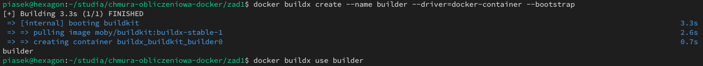

# Sprawozdanie z laboratorium Programowania aplikacji w chmurze obliczeniowej

## Autor sprawozdania: Maciej Krzysztof Piasecki (97701)

### Zadanie 1 - część dodatkowa

#### Utworzenie i uruchomienie buildera korzystającego ze sterownika docker-container

W celu utworzenia i uruchomienia kontenera budującego korzystającego ze sterownika docker-container wykonałem podane poniżej polecenie.

```shell
docker buildx create --name builder --driver=docker-container --bootstrap
```

Następnie wybrałem nowo utworzony kontener buildera, jako builder na którym będą uruchamiane podane dalej buildy.

```shell
docker buildx use builder
```

Wynik uruchomienia obu poleceń widoczny jest na zdjęciu poniżej.



#### Zmodyfikowany Dockerfile

W celu realizacji części dodatkowej utworzyłem zmodyfikowany plik `Dockerfile-frontend` wykorzystujący rozszerzony frontend, który umieściłem w repozytorium.

#### Aktywacja ssh-agent

Uruchomiłem również ssh-agent i dodałem do niego swój klucz github, jak widać na zdjęciu poniżej.


#### Zbudowanie obrazów

Ostatecznie w celu zbudowania obrazów wykonałem następujące polecenie.

```shell
docker buildx build --ssh=default --platform=linux/arm64,linux/amd64 -t piasekdev/zad1 --push -f Dockerfile-frontend .
```

Wynik wykonania polecenia widoczny jest na zdjęciu poniżej.


Jak widać na zdjęciu cache jest poprawnie wykorzystywany znacznie przyśpieszając proces budowania.

#### Link do Docker Hub

Utworzone obrazy dostępne są w repozytorium pod tym linkiem: <https://hub.docker.com/r/piasekdev/zad1/tags>.
